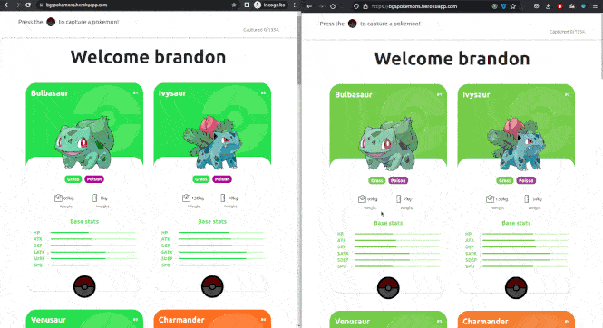

# PokeApi

With socket.io we can sync our clients when we catch a pokemon!



## Getting started

You must have installed nodejs, and mongodb locally

Install all modules for server and client apps

```bash
npm install
npx lerna bootstrap --hoist
```

Move web-client and server-api node_modules to the root node_modules

```bash
npx lerna clean -y
```

NOTE: If you want to add some module, you must do it in the package folder where you want to install that module (server-api or web-client), after it you should execute the lerna clean

## Start in development

Before start the servers you should create an .env file inside the route ./packages/server-api

It should contain a content like this:

```
MONGODB_URI="mongodb://localhost/mydb"
PORT=3001
```

For our web-client we also need to create an .env file inside the route ./packages/web-client

```
REACT_APP_POKEAPI_URL="https://pokeapi.co/api/v2/"
REACT_APP_SERVER_URL="http://localhost:3001/api/pokemon"
REACT_APP_SERVER_SOCKET="http://localhost:3001"
```

After we set the environmnet for both servers, we can start both servers using the next command in our root folder:

```bash
npm run dev
```

If we want to use start separately one whe can execute the following commands:

```bash
npm run start:client
npm run start:server
```

## Deploy using docker

NOTE: Make sure to pass the environment variables into the docker files

Re-build all images via Docker compose

```bash
npm run docker:build-all
```

Runs all containers via Docker compose

```bash
npm run docker:deploy
```
